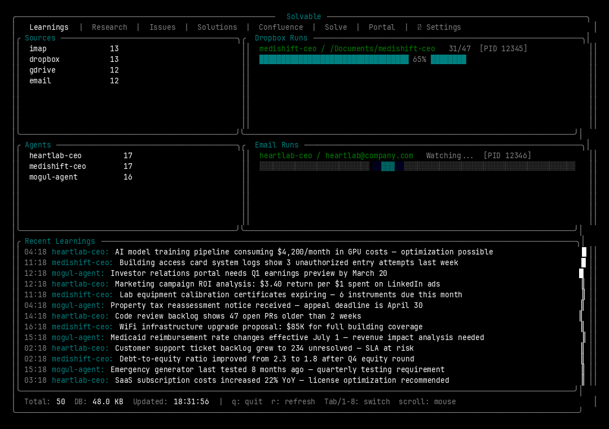
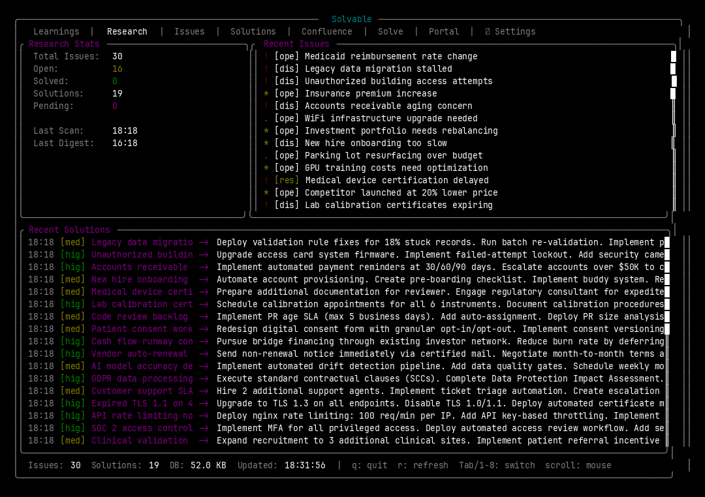
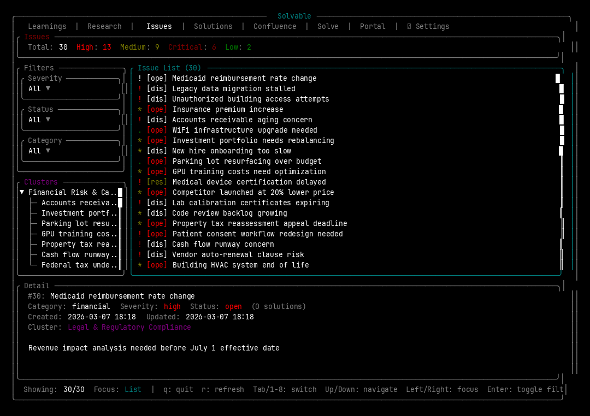
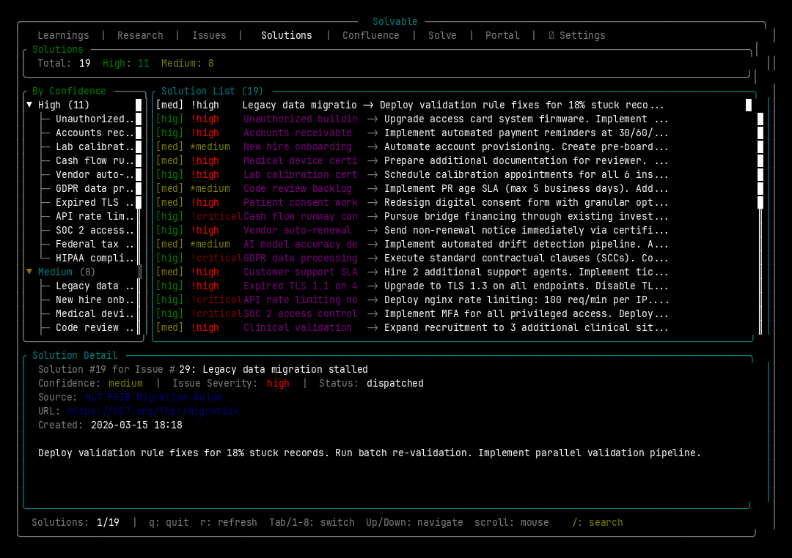
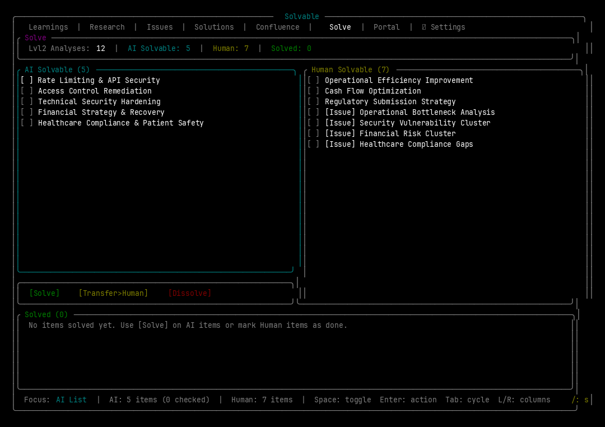
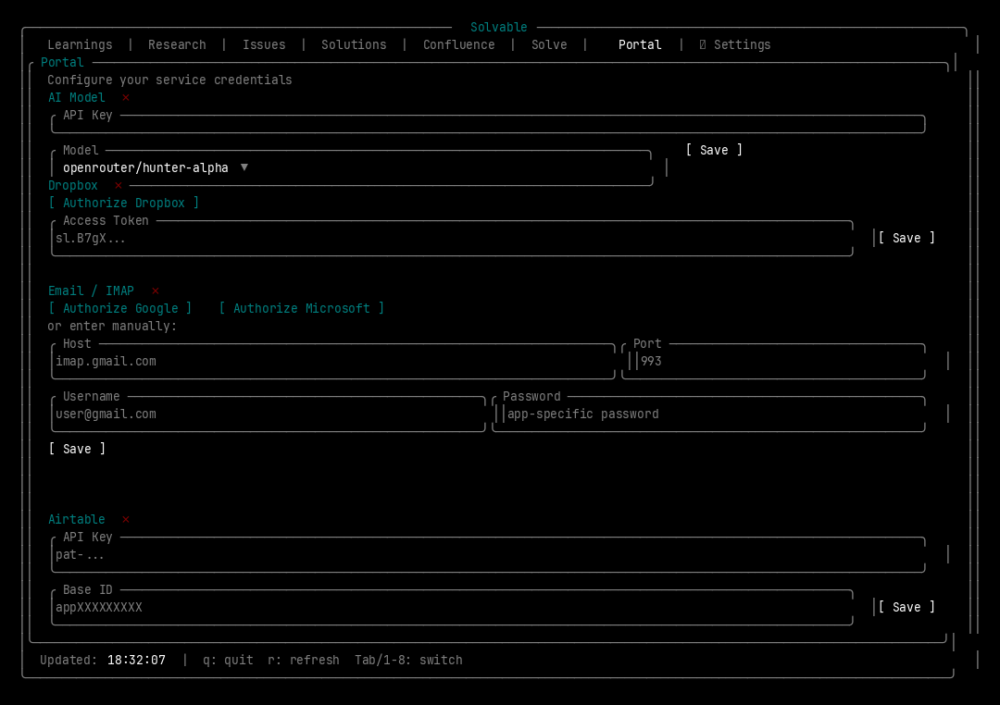

<div align="center">

# Solvable

**To solve life, one document at a time.**

AI-powered document learning platform that ingests files from Dropbox, Email (IMAP),
and Google Drive — automatically extracts insights, detects issues, researches solutions,
and builds knowledge meshes so nothing falls through the cracks.

*Ingest everything, miss nothing, solve what matters.*

[](LICENSE)
[](https://www.rust-lang.org/)
[](https://www.python.org/)
[](https://ratatui.rs/)



</div>

---

## The Problem

Your knowledge is scattered. Important issues hide in email threads, contracts sit unread in Dropbox, compliance gaps live in spreadsheets nobody opens. You know there are problems buried in your documents -- you just don't have time to read everything.

Existing tools don't help. Notion stores documents passively. Linear requires manual entry. Perplexity answers on demand, but only when you already know the question. None of them run continuously. None of them find problems you didn't know existed.

## What Solvable Does

Solvable is an auto-learning pipeline that continuously ingests documents from your data sources, extracts structured insights using LLMs, detects issues across those insights, researches solutions from the web, clusters everything into a knowledge mesh, and identifies where issue clusters meet solution clusters through **confluence analysis** -- the only system that scores whether your problems are met, unmet, or falling through the gaps. Then it helps you solve them, splitting triage into AI-solvable and human-solvable columns so you act on what matters.

```
┌─────────────────────────────────────────────────────────────────────────────────────┐
│                                                                                     │
│    DATA SOURCES              SOLVABLE PIPELINE                      OUTPUTS         │
│                                                                                     │
│   ┌──────────┐                                                                      │
│   │ Dropbox  │──┐                                                                   │
│   └──────────┘  │                                                                   │
│   ┌──────────┐  │   ┌─────────┐   ┌─────────┐   ┌──────────┐   ┌──────────────┐    │
│   │  Email   │──┼──>│ INGEST  │──>│  LEARN   │──>│ IDENTIFY │──>│Issue Clusters│    │
│   │  (IMAP)  │  │   │         │   │          │   │          │   └──────┬───────┘    │
│   └──────────┘  │   │ Fetch   │   │ LLM      │   │ Pattern  │          │            │
│   ┌──────────┐  │   │ Parse   │   │ Extract  │   │ Detect   │          │            │
│   │ Google   │──┤   │ Dedup   │   │ Chunk    │   │ Classify │          ▼            │
│   │ Drive    │  │   └─────────┘   └─────────┘   └──────────┘   ┌──────────────┐    │
│   └──────────┘  │                                               │  CONFLUENCE  │    │
│   ┌──────────┐  │   ┌─────────┐   ┌─────────┐   ┌──────────┐   │              │    │
│   │ Airtable │──┘   │RESEARCH │──>│  MESH    │──>│CONFLUENCE│──>│ Met/Unmet/   │    │
│   └──────────┘      │         │   │          │   │          │   │ Gap/Distant  │    │
│                     │ Web     │   │ Embed    │   │ Topical  │   │ Scoring      │    │
│                     │ Search  │   │ Cluster  │   │ Similari-│   └──────┬───────┘    │
│                     │ Plan    │   │ Link     │   │ ty Score │          │            │
│                     └─────────┘   └─────────┘   └──────────┘          ▼            │
│                                                                 ┌──────────────┐    │
│                                                                 │    SOLVE     │    │
│                                                                 │              │    │
│                                                                 │ AI-Solvable  │    │
│                                                                 │ Human-Solvable│   │
│                                                                 │ Multi-Select  │   │
│                                                                 └──────────────┘    │
│                                                                                     │
│   ┌─────────────────────────────────────────────────────────────────────────────┐    │
│   │                     TERMINAL UI  (Ratatui / Rust)                          │    │
│   │  ┌──────────┬──────────┬────────┬───────────┬────────────┬───────┬───────┐ │    │
│   │  │Learnings │ Research │ Issues │ Solutions │ Confluence │ Solve │Portal │ │    │
│   │  └──────────┴──────────┴────────┴───────────┴────────────┴───────┴───────┘ │    │
│   │              + Settings tab with pipeline performance sliders              │    │
│   └─────────────────────────────────────────────────────────────────────────────┘    │
│                                                                                     │
└─────────────────────────────────────────────────────────────────────────────────────┘
```

## Key Features

### Confluence Analysis

The feature that sets Solvable apart. After clustering your issues and solutions into semantic groups, Solvable computes topical similarity scores between every issue cluster and solution cluster. The result is a partitioned view: **met** (solutions exist), **unmet** (no solutions found), **gap** (partial coverage), **distant** (loosely related), and **stale** (outdated). You see at a glance which problems are covered and which are silently falling through the cracks. No other tool does this.

### Auto Issue Detection

Solvable doesn't wait for you to file a ticket. It reads your documents, detects patterns across hundreds of learnings, and creates categorized, severity-scored issues automatically. Issues are classified by category and status, filterable in the TUI, and linked back to the source documents that spawned them.

### AI + Human Solve

The Solve tab presents a split-screen triage view. Items with actionable auto-generated steps go into the AI-solvable column. Items requiring human judgment go into the human-solvable column. Multi-select items, trigger a solve, and watch progress in real time. The system doesn't replace your judgment -- it separates the noise so you can focus on decisions that actually need a human.

### Multi-Source Ingestion

Connect Dropbox folders, IMAP email accounts, Airtable bases, and Google Drive. Solvable fetches files recursively, extracts text from PDFs, DOCX, XLSX, PPTX, and plain text, deduplicates on file path, and handles large documents by chunking before LLM extraction. Run in parallel with aggressive mode for 3x throughput per source.

## The TUI -- 8 Interactive Tabs

Solvable ships with a full terminal UI built in Rust with Ratatui. Navigate with `Tab` or number keys `1-8`.

| Tab | What It Shows |
|-----|---------------|
| **Learnings** | Real-time ingestion dashboard. Active runs with progress bars, learning counts by source (Dropbox, Email, IMAP, GDrive), per-agent breakdowns, and a scrollable feed of the latest extracted insights. |
| **Research** | Issue detection and solution statistics. Total issues, open vs. solved counts, pending digest items, solution totals, and timestamps for the last scan and digest cycle. |
| **Issues** | Full issue browser with dropdown filters for severity, status, and category. Select any issue to see its description, linked solutions, cluster membership, and timestamps in a detail pane. Supports tree view and search. |
| **Solutions** | Confidence-scored solution list linked to parent issues. Grouped by confidence level with source URLs, titles, and summaries. Tree view and search supported. |
| **Confluence** | The met/unmet partitioned view. Stats bar shows met, unmet, gap, distant, and stale counts. Side-by-side panels for met and unmet confluences. Select any confluence and trigger a solve directly from this tab. |
| **Solve** | Split-screen AI-solvable vs. human-solvable columns. Multi-select with checkboxes, batch solve with progress tracking, and a solved items box at the bottom. Search overlay for finding specific items. |
| **Portal** | Credential and OAuth management. Configure your OpenRouter API key, select LLM models from a dropdown, enter Dropbox tokens, IMAP credentials, and Airtable keys. OAuth authorization buttons for Google, Microsoft, and Dropbox. |
| **Settings** | System analysis display and pipeline performance sliders. Tune ingestion batch size, learning chunk size, research limits, issue mesh cap, solution limits, Lvl2 batch size, confluence cap, and debloat rate. Save, reset, and refresh buttons. |

<details>
<summary><strong>View all tab screenshots</strong></summary>

| Tab | Screenshot |
|-----|-----------|
| Learnings |  |
| Research |  |
| Issues |  |
| Solutions |  |
| Confluence |  |
| Solve |  |
| Portal |  |
| Settings |  |

</details>

## Quickstart

```bash
git clone https://github.com/anoop-titus/Solvable.git
cd Solvable
cp .env.example .env && cp config.example.yaml config.yaml
./setup.sh              # Install dependencies + build TUI
./solvable              # Launch the dashboard
```

Edit `.env` with your API keys and `config.yaml` with your data sources before running.

## CLI Reference

```
solvable                          TUI dashboard (default)
solvable learn [flags]            Ingestion daemon
solvable research [flags]         Research daemon
solvable ingest                   Quick single-pass ingestion
solvable status                   Combined status of all services
solvable stop                     Stop all daemons gracefully
solvable nuke                     Force-kill all processes
solvable --version                Print version (0.2.0)
```

### Learn Flags

```
--once                            Single pass, all sources, exit
--parallel, -p                    Run sources in parallel
--dropbox                         Dropbox sources only
--email                           Email/IMAP sources only
--aggressive, -a                  3x process multiplier per source
--research                        Include research daemon alongside
--stop [RUN_ID]                   Stop daemon or specific run
--status                          Show daemon status
--jobs                            List active jobs
```

### Research Flags

```
--once                            Single pass, all phases, exit
--status                          Daemon status + DB stats
--jobs                            Research statistics
--stop                            Stop daemon
--nuke                            SIGKILL all research processes
--fix [--issue ID] [--dry-run]    Fix specific issue or category
--approve ID                      Approve pending issue
--dismiss ID                      Dismiss pending issue
--list-pending                    List issues awaiting approval
--model MODEL                     Set/reset OpenRouter model
--solution                        Create solution plans (single pass)
--solution-daemon                 Solution planning daemon (10-min cycle)
--issue-mesh-daemon               Issue mesh daemon (30-sec cycle)
--confluence-daemon               Confluence daemon (60-sec cycle)
--lvl-2-daemon                    Level-2 mesh daemon
--confluence                      Confluence analysis (single pass)
--view [solution|daemon|lvl2]     Tail log files
--activate                        Enable all research services
--deactivate                      Disable all research services
```

### Examples

```bash
solvable learn --parallel -a           # Aggressive parallel ingestion
solvable research --fix --issue 42 --dry-run
solvable research --model openrouter/google/gemini-2.5-flash
solvable research --confluence         # Single confluence pass
solvable research --activate           # Start all research daemons
```

## How It Works

### The 7-Stage Pipeline

**1. Ingest** -- Connects to configured data sources (Dropbox, IMAP, Airtable, Google Drive). Recursively lists files, downloads content, extracts text from PDFs, DOCX, XLSX, PPTX, and plain text. Deduplicates by file path. Prioritizes business documents over source code. Supports IMAP IDLE watch mode for real-time email processing.

**2. Learn** -- Sends extracted text to an LLM via OpenRouter (configurable model -- default Gemini 2.5 Flash). Large documents are chunked at configurable boundaries (default 100K chars). The LLM receives a per-agent system prompt and returns structured JSON arrays of insights: key decisions, action items, deadlines, financial figures, relationships, and strategic observations.

**3. Identify** -- Scans accumulated learnings for patterns. Detects recurring themes, conflicts, risks, and gaps across documents and sources. Creates categorized issues with severity scores and links them back to the learnings that triggered detection.

**4. Research** -- For each identified issue, performs web search and AI-powered solution planning. Generates solution summaries with source URLs, confidence scores, and actionable recommendations.

**5. Mesh** -- Builds embedding-based clusters of related issues (issue clusters) and related solutions (solution clusters). Uses semantic similarity to group items that human categorization might miss. Stored in a dedicated mesh database.

**6. Confluence** -- The core differentiator. Computes topical similarity between every issue cluster and every solution cluster. Scores each pair and assigns a status: **met** (high similarity, solutions exist), **unmet** (issues with no matching solutions), **gap** (partial coverage), **distant** (low similarity), or **stale** (outdated). This is where Solvable tells you what's falling through the cracks.

**7. Solve** -- Presents confluences and Lvl2 analyses in a triage interface. Items with auto-generated action steps are classified as AI-solvable. Items requiring human judgment are classified as human-solvable. Multi-select, trigger batch solving, and track resolution progress.

## Architecture

```
┌───────────────────────────────────────────────────────────────────────────────┐
│                              SOLVABLE  v0.2.0                                │
├───────────────────────────────────────────────────────────────────────────────┤
│                                                                               │
│   PRESENTATION LAYER                                                          │
│   ┌─────────────────────────────────────────────────────────────────────────┐ │
│   │                    Terminal UI  (Rust + Ratatui 0.29)                   │ │
│   │   Crossterm backend | Tokio async | OAuth2 flows | SQLite (rusqlite)   │ │
│   │                                                                         │ │
│   │   8 Tabs: Learnings | Research | Issues | Solutions |                  │ │
│   │           Confluence | Solve | Portal | Settings                       │ │
│   │                                                                         │ │
│   │   Widgets: Dropdowns | Sliders | Tree views | Search | Text inputs     │ │
│   └─────────────────────────────────────────────────────────────┬───────────┘ │
│                                                                  │ reads       │
│   DAEMON LAYER                                                   │             │
│   ┌──────────────────────┐   ┌──────────────────────────────┐    │             │
│   │   learn  (Python)    │   │   research  (Python)         │    │             │
│   │                      │   │                              │    │             │
│   │  learn_dropbox.py    │   │  Issue detection             │    │             │
│   │  learn_email_imap.py │   │  Solution planning           │    │             │
│   │  learn_email.py      │   │  Issue mesh clustering       │    │             │
│   │                      │   │  Lvl2 analysis               │    │             │
│   │  Parallel / Seq      │   │  Confluence scoring          │    │             │
│   │  Aggressive mode     │   │  Fix / Approve / Dismiss     │    │             │
│   └──────────┬───────────┘   └──────────────┬───────────────┘    │             │
│              │ writes                        │ writes             │             │
│              ▼                               ▼                   ▼             │
│   STORAGE LAYER                                                               │
│   ┌─────────────────────────────────────────────────────────────────────────┐ │
│   │                        SQLite  (WAL mode)                              │ │
│   │                                                                         │ │
│   │  db/learnings.db          research.db             mesh.db              │ │
│   │  ├─ learnings             ├─ issues               ├─ issue_clusters    │ │
│   │  ├─ processed_files       ├─ solutions            ├─ solution_clusters │ │
│   │  └─ run_progress          └─ digests              ├─ lvl2_analyses     │ │
│   │                                                    └─ confluences       │ │
│   └─────────────────────────────────────────────────────────────────────────┘ │
│                                                                               │
│   EXTERNAL SERVICES                                                           │
│   ┌──────────────┐  ┌──────────────┐  ┌──────────────┐  ┌──────────────┐     │
│   │  OpenRouter   │  │   Dropbox    │  │  IMAP Server │  │  Airtable    │     │
│   │  (LLM API)   │  │   (OAuth2)   │  │  (SSL/TLS)   │  │  (REST API)  │     │
│   └──────────────┘  └──────────────┘  └──────────────┘  └──────────────┘     │
│                                                                               │
└───────────────────────────────────────────────────────────────────────────────┘
```

### Tech Stack

| Component | Technology |
|-----------|-----------|
| TUI | Rust, Ratatui 0.29, Crossterm 0.28 |
| Async runtime | Tokio |
| Ingestion daemons | Python 3.10+ |
| Document parsing | PyPDF2, python-docx, openpyxl, python-pptx |
| LLM provider | OpenRouter (any model -- Gemini, Claude, GPT, Llama) |
| Database | SQLite with WAL mode (3 databases) |
| OAuth | oauth2 crate (Rust) for Google, Microsoft, Dropbox |
| HTTP | reqwest (Rust), requests (Python) |

## Use Cases

### Property Manager

You manage 50+ lease agreements, vendor contracts, and compliance documents across multiple properties. Solvable ingests everything from your Dropbox and email, automatically detects expiring leases, missing insurance certificates, and maintenance compliance gaps. Confluence analysis shows which compliance issues have actionable vendor solutions and which require your direct attention.

### Startup CTO

Your team produces architecture docs, incident reports, sprint retros, and Slack exports dumped to Drive. Solvable reads them all, identifies recurring technical debt patterns, surfaces unresolved incidents that match known solutions, and clusters related issues that different teams filed independently. The Solve tab separates automated fixes (config changes, dependency updates) from decisions that need human judgment (architecture trade-offs, staffing).

### Solo Founder

You're drowning in investor updates, legal documents, operational emails, and financial reports. Solvable processes your entire inbox and document folders, detects issues like missed filing deadlines, conflicting contract terms, and budget overruns you hadn't noticed. Confluence scoring shows which investor concerns are already addressed by your operational plans and which are dangerously unmet.

## Configuration

### config.yaml

The main configuration file controls data sources, LLM settings, and agent behavior.

```yaml
# LLM model for learning extraction (OpenRouter format)
model: "openrouter/google/gemini-2.5-flash"

# Chunk size for splitting large documents (chars)
chunk_size: 100000

# IMAP email accounts
imap:
  host: "127.0.0.1"
  port: 993
  accounts:
    my-account:
      email: "user@example.com"
      agent: "my-agent"
      env_user: "IMAP_USERNAME"
      env_pass: "IMAP_PASSWORD"

# Dropbox folders mapped to agents
dropbox:
  folders:
    - agent: "my-agent"
      path: "/Documents/Project-A"

# Per-agent LLM extraction prompts
agents:
  my-agent:
    prompt: >
      You are a learning agent extracting knowledge from documents.
      Focus on: key decisions, action items, deadlines, financial figures.
      Extract 3-8 specific learnings as a JSON array of strings.
```

### .env

API keys and credentials in shell export format.

| Variable | Required | Description |
|----------|----------|-------------|
| `OPENROUTER_API_KEY` | Yes | OpenRouter API key for LLM calls |
| `DROPBOX_REFRESH_TOKEN` | For Dropbox | OAuth2 refresh token |
| `DROPBOX_APP_KEY` | For Dropbox | Dropbox app key |
| `DROPBOX_APP_SECRET` | For Dropbox | Dropbox app secret |
| `AIRTABLE_API_KEY` | For Airtable | Airtable personal access token |
| `AIRTABLE_BASE_ID` | For Airtable | Airtable base ID |
| `AIRTABLE_EMAIL_TABLE_ID` | For Airtable | Table ID for email records |
| `IMAP_USERNAME` | For IMAP | IMAP login username |
| `IMAP_PASSWORD` | For IMAP | IMAP login password |

## Supported File Types

| Format | Extensions | Parser |
|--------|-----------|--------|
| PDF | `.pdf` | PyPDF2 |
| Word | `.docx`, `.doc` | python-docx |
| Excel | `.xlsx`, `.xls` | openpyxl |
| PowerPoint | `.pptx`, `.ppt` | python-pptx |
| Plain text | `.txt`, `.md`, `.csv`, `.json`, `.yaml` | UTF-8 decode |

## Tests

```bash
python3 -m pytest tests/ -v
```

Test coverage includes email fetch ordering, spam filtering, IMAP credential validation, parallel task generation, and watch mode status transitions.

## Contributing

Contributions are welcome. Please open an issue first to discuss what you'd like to change.

1. Fork the repository
2. Create your feature branch (`git checkout -b feature/your-feature`)
3. Write tests for new functionality
4. Ensure all tests pass (`python3 -m pytest tests/ -v`)
5. Build the TUI (`cd learner-tui && cargo build --release`)
6. Commit your changes
7. Open a pull request

## License

MIT License. See [LICENSE](LICENSE) for details.

---

<div align="center">
<sub>Built with care. Powered by curiosity. Solvable -- to solve life.</sub>
</div>
